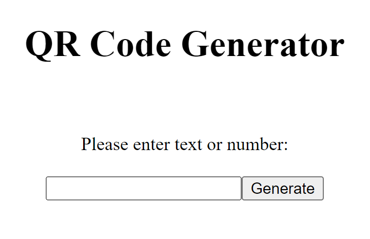

# PHP-EAN-to-QR

A simple QR-Code program in PHP

## Screenshots




## Installation

Just put the index.php file and the phpqrcode folder on your webserver

On Ubuntu just restart Apache:
```bash
    sudo /etc/init.d/apache2 restart
```
On CentOS just restart httpd.service:
```bash
    sudo systemctl restart httpd.service
```

## Authors

- [@kai.rohrpasser](https://github.com/Dr-PPSN)

## Feedback

If you have any feedback, please reach out to me at KR@hevor.de